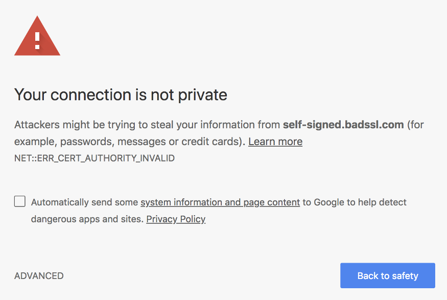
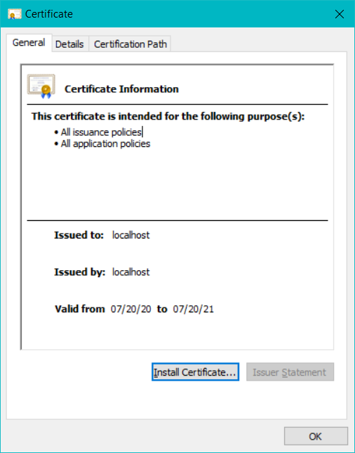
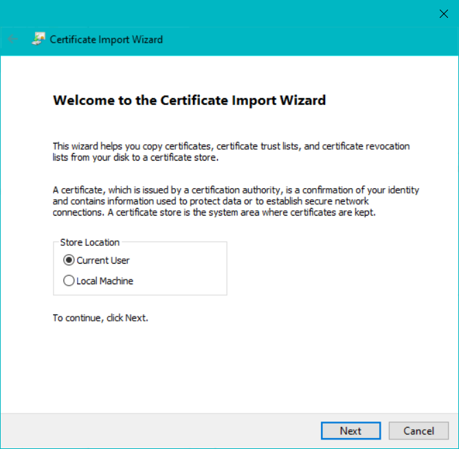
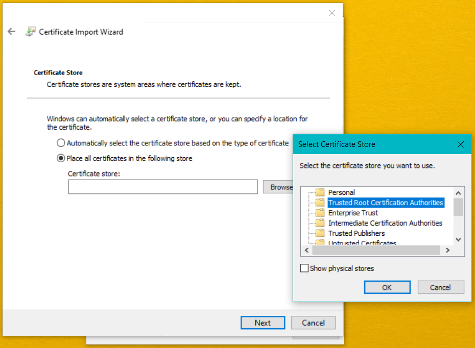
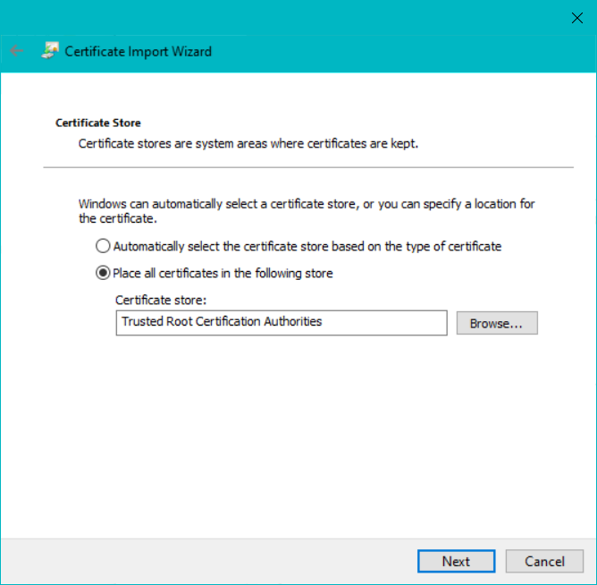
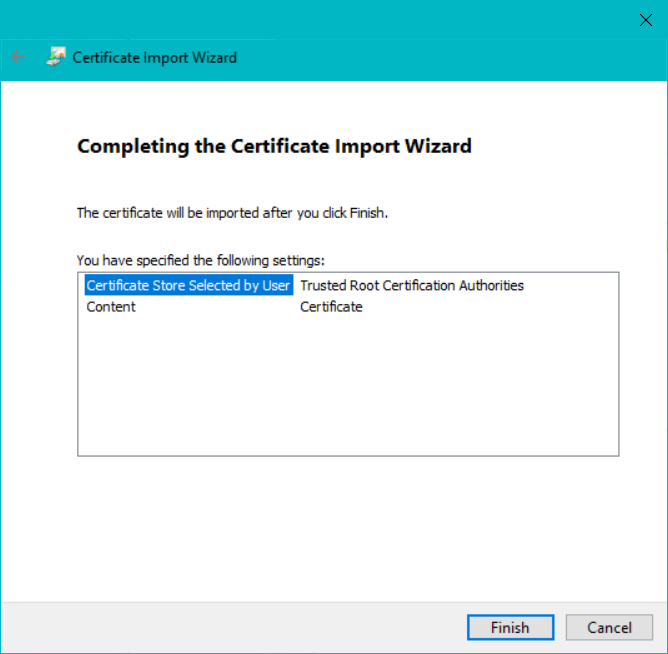
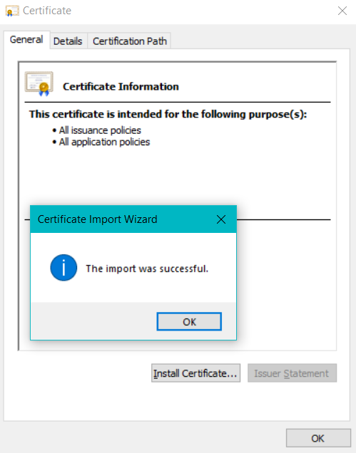

###### Angular CLI v10.0.2
###### NodeJS v12.18.0
###### NPM v6.14.4

# Hướng dẫn sử dụng

**Bước 1:** Clone source code về và bật **Terminal** chạy lệnh sau để cài đặt các modules được sử dụng trong source code tại thư mục `root`

```
npm install
``` 

**Bước 2:** Bật **Terminal** tại thư mục `projects/backend` và chạy lệnh sau để cài đặt các modules được sử dụng trong project Backend-API.

```
npm install
``` 

**Bước 3:** Bật **Terminal** tại thư mục `root` và chạy 1 trong các lệnh sau

Khởi động toàn bộ project: **`npm start`**

Khởi động project Backend-API và Admin: **`npm run ckc-api-admin`**

Khởi động project Backend-API và CNTT: **`npm run ckc-api-cntt`**

Khởi động project Backend-API và Elearning: **`npm run ckc-api-elearning`**

Khởi động project Backend-API và TTTH: **`npm run ckc-api-ttth`**

Khởi động project Backend-API: **`npm run ckc-admin`**

Khởi động project Admin: **`npm run ckc-admin`**

Khởi động project CNTT: **`npm run ckc-cntt`**

Khởi động project Elearning: **`npm run ckc-elearning`**

Khởi động project TTTH: **`npm run ckc-ttth`**

*Ghi chú:*

- Project Backend-API chạy trên port **:4100**

- Project Admin chạy trên port **:4200**

- Project CNTT chạy trên port **:4300**

- Project Elearning chạy trên port **:4400**

- Project TTTH chạy trên port **:4500**


# GitHub workflow

**Bước 1:** Clone source code (Chỉ thực hiện 1 lần)

```
git clone https://github.com/CaoThangEducation/CaoThangAngular.git
```

**Bước 2 (QUAN TRỌNG):** Chuyển về branch của nhóm

```
git checkout 'tên branch'
```

**Nhóm các bạn sẽ code tại branch đó.**


**Bước 3:** Commit code của bạn lên **branch** và lưu commit đó lên GitHub

```
git add .
git commit -m 'nội dung commit, bạn sẽ nhập thông tin này'
git push    # Lưu code lên GitHub remote
```

**Bước 4:** Đồng bộ code giữa các thành viên trong nhóm với nhau

- **4.1:** Kiểm tra những thay đổi chưa được đồng bộ trong branch

```
git status
```

*Hãy thực hiện bước tiếp theo nếu kết quả trả về là **`Your branch is behind <tên branch> by <số thay đổi> commits, and can be fast-forwarded.`***

- **4.2:** Commit code của bạn

```
git add .
git commit -m 'nội dung commit, bạn sẽ nhập thông tin này'
```

- **4.3:** Đồng bộ code từ thành viên khác và lưu những thay đổi đó lên GitHub

```
git pull    # Xử lý các conflict (nếu có) trước khi push
git push    # Lưu code lên GitHub remote
```

# Đồng bộ dữ liệu từ branch master về branch của nhóm

**QUAN TRỌNG:** Hãy **commit**, **pull**, **push** code của **tất cả thành viên** trong nhóm lên GitHub trước khi thực hiện đồng bộ những thay đổi từ branch master. Mỗi nhóm đại diện **1 thành viên** thực hiện bước đồng bộ thay đổi từ branch master. Các thành viên khác trong nhóm chỉ việc

```
git checkout master
git pull    # Cập nhật chỉnh sửa mới nhất từ Master về máy của bạn
git checkout 'branch của nhóm'
git merge master # Sau khi chạy lệnh này, ta sẽ tiến hành kiểm tra các conflict(Nếu có)
git push
```

# Mô hình dữ liệu

<p align='center'>
  
</p>

# Các modules sử dụng

**Roboto** được sử dụng làm webfont cho toàn bộ project, bao gồm các font-weight sau `300`, `400`, `500`, `700`, `900`

### Backend-API

1. body-parser@1.19.0
2. cors@2.8.5
3. express@4.17.1
4. mongoose@5.9.23

### Admin

1. @fortawesome/fontawesome-free@5.13.1
2. @mdi/font@5.3.45
3. bootstrap@4.5.0
4. jquery@3.5.1
5. select2@4.0.13
6. swiper@6.0.2
7. vanilla-lazyload@17.1.0
8. angular-datatables@9.0.2
9. datatables.net": "^1.10.21",
10. datatables.net-dt": "^1.10.21",
11. @ckeditor/ckeditor5-angular@1.2.3
12. @ckeditor/ckeditor5-build-classic@20.0.0
13. ngx-useful-swiper @9.0.3

### CNTT

1. @fortawesome/fontawesome-free@5.13.1
2. @mdi/font@5.3.45
3. bootstrap@4.5.0
4. jquery@3.5.1
6. swiper@6.0.2
7. vanilla-lazyload@17.1.0
8. aos@2.3.4

### Elearning

1. @fortawesome/fontawesome-free@5.13.1
2. @mdi/font@5.3.45
3. bootstrap@4.5.0
4. jquery@3.5.1

### TTTH

1. @fortawesome/fontawesome-free@5.13.1
2. bootstrap@4.5.0
3. jquery@3.5.1
4. swiper@6.0.2
5. aos@2.3.4

# Fix lỗi `Certificate is not trusted` trên Web browser

<p align='center'>
  
</p>

1. Vào thư mục **ssl** double click file **localhost.crt** và chọn ***Install Certificate...***

<p align='center'>
  
</p>

2. Chọn **Current User** hoặc **Local Machine**

<p align='center'>
  
</p>

3. Chọn **Place all certificates in the following store** > **Browse** > **Trusted Root Certification Authorities** > **OK**

<p align='center'>
  
</p>

3. Click **Next**

<p align='center'>
  
</p>

4. Click **Finish**

<p align='center'>
  
</p>

5. Cài đặt thành công

<p align='center'>
  
</p>

6. Khởi động lại máy tính

# Structure & Generate

Xem chi tiết tại [structure.txt](structure.txt)
